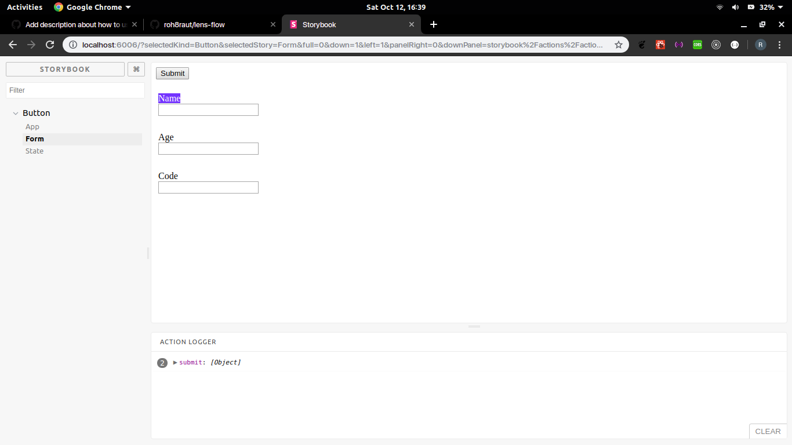

# lens-flow

1.Clone the Repo  
  * ` git clone git@github.com:roh8raut/lens-flow.git` 
  
2. cd `dir` name  
3. Run `npm install` to install the dependencies  
4.Lastly `"npm start"` to start the application

# Application

